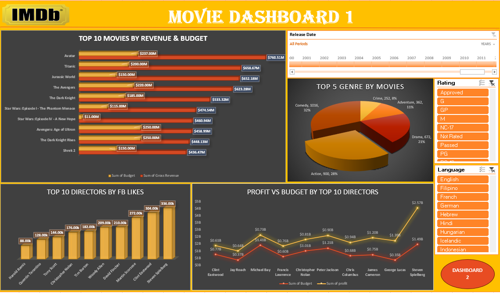

# Advance-Excel-Project
## Project Title
IMDB Movies Analysis Dashboard

## Description
This project analyzes and visualizes a dataset of movies using Advanced Excel features. The primary aim is to showcase trends, insights, and summary statistics related to movie production, financials, and social media metrics. The project includes interactive dashboards and summary sheets to present actionable insights in a user-friendly format.

## Key Features
- IMDB Dataset Analysis: Detailed dataset with key attributes like genre, ratings, financials, and social media metrics.
- Financial Insights: Analysis of gross revenue, budgets, and profits for movies.
- Interactive Dashboards: Two comprehensive dashboards summarizing movie trends and key performance indicators.
- Aggregated Statistics: Summary of data by genre, release date, and social media engagement.

## Contents
1. IMDB Dataset:
   - Comprehensive dataset of movies with fields including title, release date, genre, language, country, IMDb scores, financial details (gross revenue, budget, profit), and Facebook likes for cast, directors, and movies.
2. Sheet1:
   - Aggregated data summarizing gross revenue, budgets, and counts by genre.
3. Sheet2:
   - Summary statistics, including cast Facebook likes grouped by dates or movie titles.
4. Dashboard 1:
   - Interactive visualizations presenting high-level insights into movie financials and ratings.
5. Dashboard 2:
   - Additional visualizations focusing on detailed metrics like social media engagement and profitability.

## Instructions
1. Download the File: Clone or download the repository to access the `Project.xlsx` file.
2. Open in Excel: Ensure you have Excel 2016 or later to use advanced features like slicers and pivot tables.
3. Interact with Dashboards: Navigate to the "Dashboard 1" and "Dashboard 2" sheets for interactive visuals and summaries.
4. Explore the Data: Use filters and slicers to dynamically explore the dataset.

## Tools and Features Used
- Excel Pivot Tables and Pivot Charts.
- Slicers for dynamic filtering.
- Conditional Formatting to highlight trends.
- Data Aggregation and Formulas for insights.

## Screenshots

